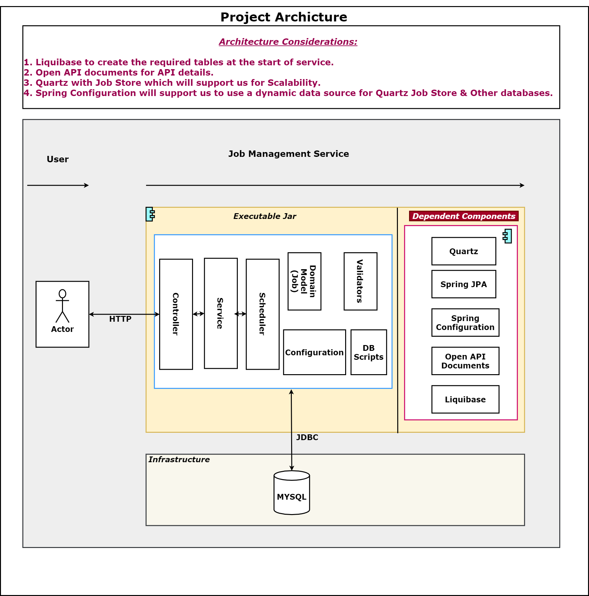
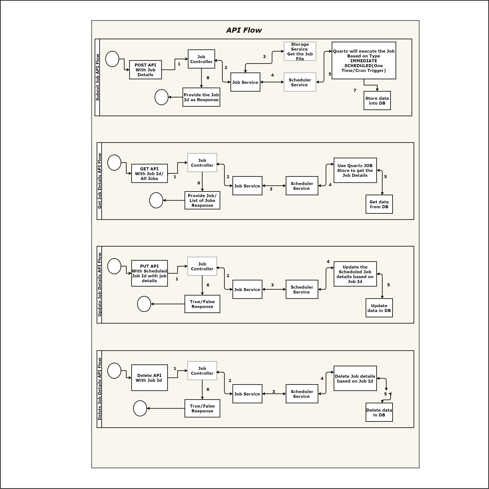

# Getting Started

### Swagger At : http://localhost:8080/jms/swagger-ui/index.html?configUrl=/jms/v3/api-docs/ 

### Project Architecture





* Job Submission   
	* 1 : User posts a job with job file and other request parameters.
    * 2 : Job controller propagates request to job services.
    * 3 : Job service validates the request, saves the file and schedules the job for execution.
    * 4 : Job service validates the request, propagates request to scheduler service.
	* 5 : Scheduler service saves the job details to db with job status as 'QUEUED'.
    * 6 : Job scheduler triggers the specific job executor based on job type. The job executor executes the job.
    * 7 : Job status are updated in repository with 'RUNNING | FAILED | SUCCESS'. At the end of the job execution.
    
* Job Retrieve Job By Id 
	* 1 : User requests a job details with job id.
    * 2 : Job controller propagates request to job services.   
	* 3 : Job service validates the request, propagates request to scheduler service.
    * 4 : Scheduler service updates the status if any triggers are valid.
    * 5 : Scheduler service get the data based on job id 
	* 6 : Retrieves all job details from db and returns the same as response. 
    
* Job Retrieve All Jobs
	* 1 : User requests for all jobs.
    * 2 : Job controller propagates request to job services.   
	* 3 : Job service validates the request, propagates request to scheduler service.
    * 4 : Scheduler service updates the status if any triggers are valid.
    * 5 : Scheduler service get all the job details form DB
	* 6 : Returns the same as response. 
	
* Job Update(Only Schdeuler Job Update/Immediate Jobs cann't be updated)   
	* 1 : User posts a job with request parameters for scheduled jobs.
    * 2 : Job controller propagates request to job services.
    * 3 : Job service validates the request, propagates request to scheduler service.
	* 4 : Scheduler service update the job details to db with job status as 'QUEUED'.
    * 5 : Job scheduler triggers the specific job executor based on job type. The job executor executes the job.
    * 6 : Returns the True/False as response.
	
* Job Delete By Id 
	* 1 : User requests a delete job details with job id.
    * 2 : Job controller propagates request to job services.   
	* 3 : Job service validates the request, propagates request to scheduler service.
    * 4 : Scheduler service updates the status if any triggers are valid.
    * 5 : Scheduler service delete the data based on job id in data base.
	* 6 : Returns the True/False as response.
	
### Project Modules
The project consists of following modules:
* [Job Management Service] (https://github.com/CaseStudy-JM/jm-serivce-quartz): spring boot service for submit,update,delete and retrive jobs, with following features.
    * Submit job
	* Update scheduler job details
	* Delete job by id
    * Retrieve job by id
    * Retrieve all jobs
* Job Modules
    * [Job Starter] (https://github.com/CaseStudy-JM/jm-job-starter): spring boot starter job for creating jobs. 
    * [Job Logger] (https://github.com/CaseStudy-JM/jm-job-logger): simple job which logs 'Hello'. 
    * [Job Send Emails] (https://github.com/CaseStudy-JM/jm-job-send-email): 
        * Read the file datas and send the emails.
		* User can provide a file path as paramters or by default file will be reffered from class path.
    * [Job Loads File Data To DB] : (https://github.com/CaseStudy-JM/jm-job-load-data)
		* User can provide a file path as argument or by default file will be reffered from class path.
        * Read the file datas and load to database

### Build & Run
* Build [Job Starter] (https://github.com/CaseStudy-JM/jm-job-starter): job starter is to be built before building any job.
    * **Build it** : *mvnw.cmd clean install*

* Build Actual Jobs:
    * [Job Logger] (https://github.com/CaseStudy-JM/jm-job-logger)
    * [Job Send Emails](https://github.com/CaseStudy-JM/jm-job-send-email)
    * [Job Loads File Data To DB](https://github.com/CaseStudy-JM/jm-job-load-data)
        * **Build it** : *mvnw.cmd clean package*
    **Note**: the generated jar files are to be used as job files for job service.

* Build Job Service:        
    * **Build it** : *mvnw.cmd clean package*
    * **Run It** : *java -jar target\jm-service-0.0.1-SNAPSHOT.jar*
    * **Test Via API Swagger** http://localhost:8080/jms/swagger-ui/index.html?configUrl=/jms/v3/api-docs/
### API Usage
 * Job Submission 
     * Request URL : http://localhost:8080/jms/api/v1/job
     * Request Body:
        ```
        form : {job}.jar
		jobName: job_name
		jobGroupName: job_group_name
        jobType : SPRING_BOOT_JAR
        executionType : IMMEDIATE/SCHEDULED
        parameters : 'optional, space seperated parameter for job'
        environmentString : 'optional, space seperated environment variable for job'
        priority : 'optional, int value representing job priority (1-10)' Default value 5
        schedule : 'optional, schedule represented in 'yyyy-MM-dd HH:mm:ss' format' 
		cronExpression: cron expression to repeat the jobs
		repeatTime: job to repeate on interval default value 60000
        ```
     * Response Header:
        ```
        Location : http://localhost:8080/jms/api/v1/job/{jobId} 
        ```
     * Response Status:
        ```
        201
        ```
 * Get Job By Id
     * Request URL : http://localhost:8080/jms/api/v1/job/{jobId} 
     * Response Body:
        ```
        {
          "id": {jobId},
          "type": "SPRING_BOOT_JAR",
          "status": "{QUEUED | FAILED | SUCCESS}",
          "fileLocation": ".store/{jobId}.jar",
		  "jobName": "job_name",
		  "jobGroupName: job_group_name",
		  "cronExpression": "0 0 * * 5",
		  "repeatTime": "6000",
          "schedule": {
            "executionType": "IMMEDIATE"
          }
        }
        ```
     * Response Status:
        ```
        200
        ```
  * Get All Jobs 
      * Request URL : http://localhost:8080/jms/api/v1/job
      * Response Body:
         ```
         [
             {
               "id": {jobId},
               "type": "SPRING_BOOT_JAR",
               "status": "{QUEUED | FAILED | SUCCESS}",
               "fileLocation": ".store/{jobId}.jar",
               "schedule": {
                 "executionType": "IMMEDIATE"
               }
			"jobName": "job_name",
			"jobGroupName: job_group_name",
			"cronExpression": "0 0 * * 5",
			"repeatTime": "6000",
             }
             ...
         ]
         ```
      * Response Status:
         ```
         200
         ```                

### Guides
The following guides illustrate how to use some features concretely:

* [Building a RESTful Web Service](https://spring.io/guides/gs/rest-service/)
* [Building REST services with Spring](https://spring.io/guides/tutorials/bookmarks/)
* [Building Quartz Jobs] (http://www.quartz-scheduler.org/documentation/quartz-2.3.0/examples/)
* [Liquibase integration] (https://docs.liquibase.com/tools-integrations/springboot/using-springboot-with-maven.html)